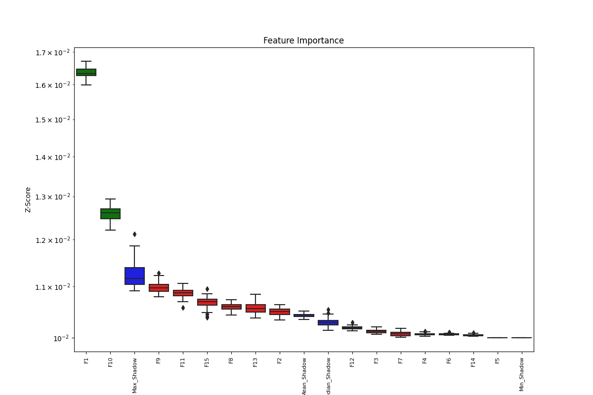
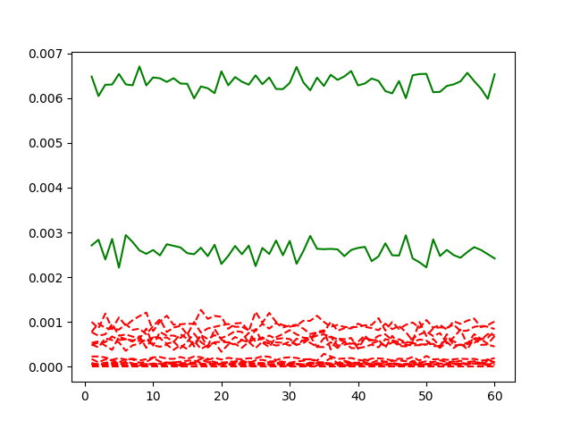

# boruta_regeressor

回归模型考虑了SVM和RanF。先通过实验选取模型参数。SVM模型主要涉及C、epsilon和kernel，其中C是正则化参数，它控制错误项的惩罚。epsilon是对误差的容忍度，它定义了在支持向量回归中的管道的宽度。kernel是核函数类型，可以选择不同的核函数（例如线性核、多项式核、径向基核等）来调整模型的复杂度和拟合能力。我们选择rbf核函数采用10折交叉验证，以MAE为评测依据，对C和epsilon参数进行寻优，结果如下：C=10.0,epsilon=0.01时效果最好。

对于RanF，决策树模型主要涉及n_estimators和max_depth.其中n_estimators决定随机森林中树的数量。它表示随机森林中包含的决策树个数。增加树的数量可以提高模型的复杂度和性能，但也可能增加过拟合的风险。max_depth表示决策树的最大深度，即树的分支层数。限制树的深度有助于控制模型的复杂度，避免过拟合。如果设置为None，则树的深度不受限制。我们采用10折交叉验证，以MAE为评测依据，对n_estimators和max_depth参数进行寻优，结果如下：n_estimators=150,max_depth=20时效果最好。

特征重要度分析
本实验采用特征优选算法Boruta，以全局最优为目标，对特征重要度进行分析。算法借助python实现，以RanF为基础模型，经过60次迭代运算，算法依序确认了2个重要特征，实验过程及结果如图所示

    

    

左图记录算法运行过程，横坐标表示迭代次数，纵坐标表示重要度，线条记录了60次迭代运算中特征变量重要度的变化轨迹。可以看到，整个运行过程中，被保留特征（绿色线条）的重要度为0.002~0.007,显著高于被拒绝特征（红色线条）的重要度。根据60次迭代结果绘制的盒图同样显示，被保留特征对回归性能的影响显著高于被拒绝特征。
